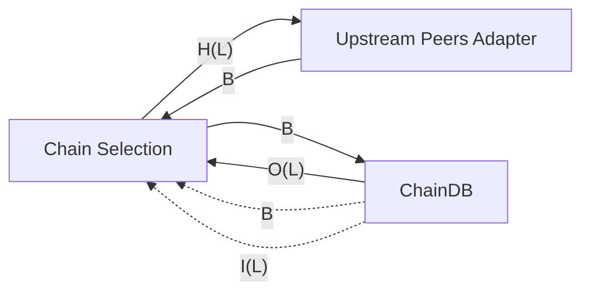
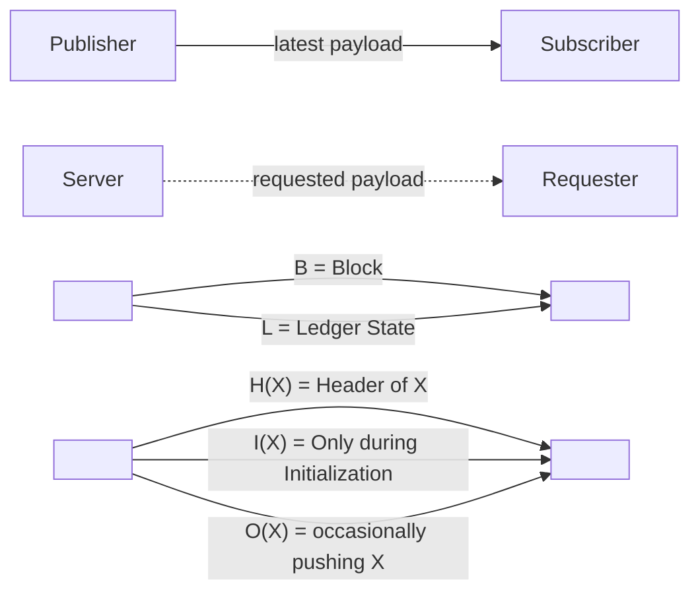

# Cardano Node Proof of Concept implementation in Typesript

## The goal

To have a fully working **passive** cardano node as described in the [ouroboros-consensus documentation](https://ouroboros-consensus.cardano.intersectmbo.org/docs/for-developers/ComponentDiagram/) and represented in the diagram reported below

Legend:

## Why?

This project will serve as a base for many other goals:

1) proving the feasibility of the following Catalyst F11 proposals:
    
    - [consensus](https://cardano.ideascale.com/c/idea/110904)
    - [network](https://cardano.ideascale.com/c/idea/111634)
    - [ledger](https://cardano.ideascale.com/c/idea/110903)

2) serve as base to then extract the only missing component fo a proper typescript cardano node ( the consensus component, as the network can be find here, and the ledger here )

3) serve as a base to then extract the "runtime indipendent" code and have a passive node running in browsers (future project)

4) be the example project for future, purpose specific nodes, that don't require all the work that a full node does, some examples (just on top of my head) could be:

    - light weight node following only the tip of the chain (example usages: some mini-protocols servers or ad-hoc chain indexer saving blocks elsewhere)
    - node that only keeps the ledger state, for optimal UTxO queries
    - etc.